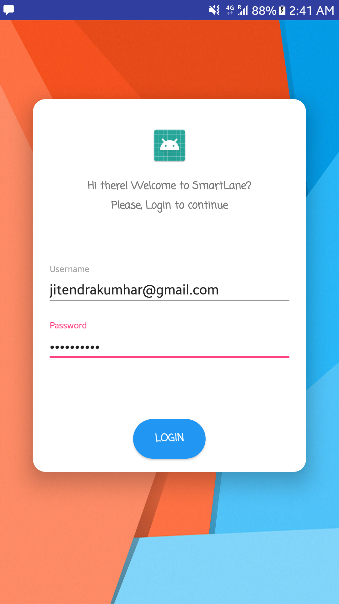
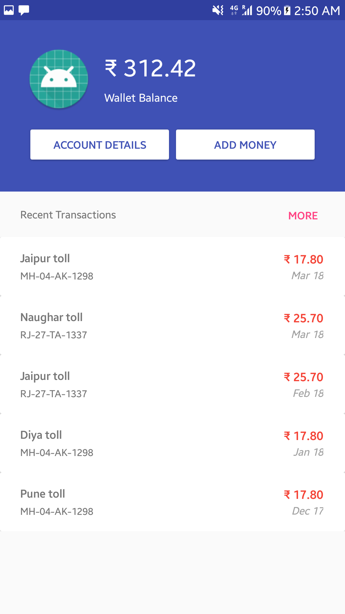
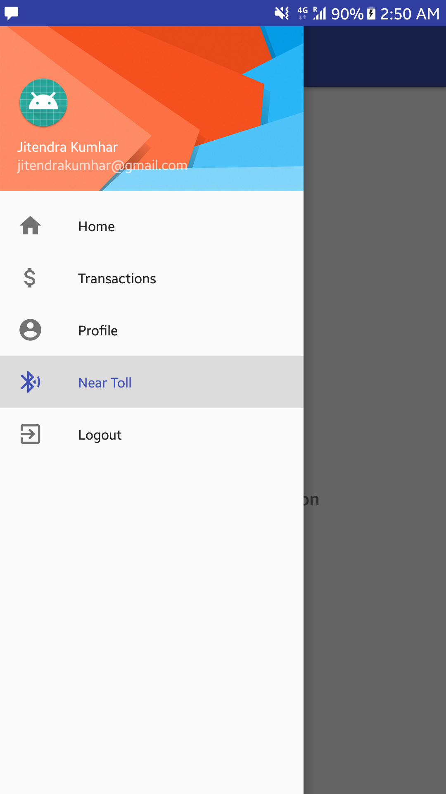
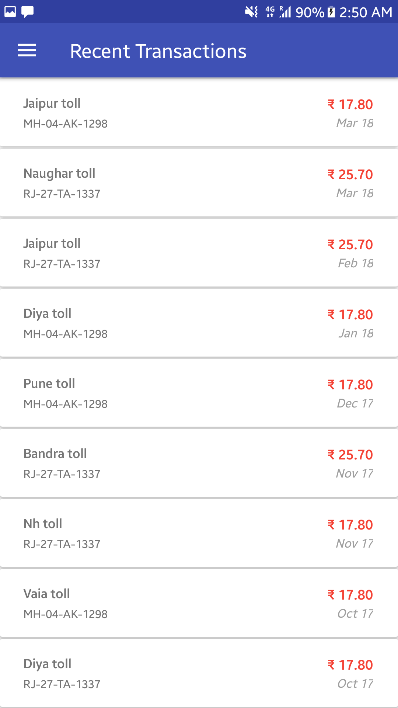
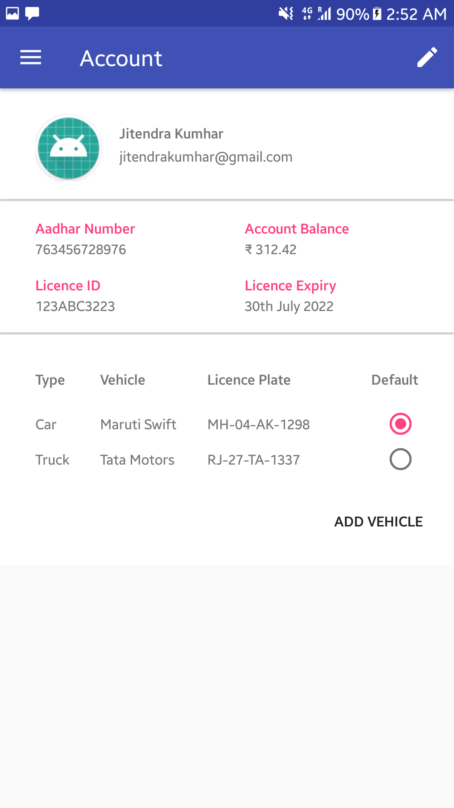
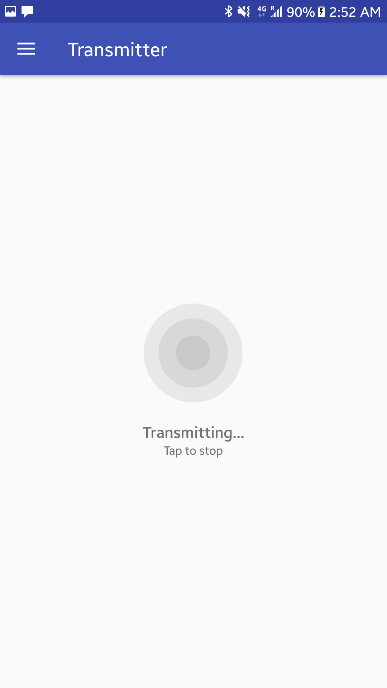

<h1 align="center">
  SmartLane
   
</h1>

<h4 align="center">An intelligent tolling system with minimum dependencies</h4>

<table>
<tr>
<td>
SmartLane is a Bluetooth beacon based solution for efficiently doing transactions and analysis of vehicle traffic. Since, all mobile devices already have BLE features, the project can be implemented very feasibly. Very little changes have to be made to the existing architecture of toll plaza.
</td>
</tr>
</table>

### Main features

* Bluetooth Beacon (EddyStone) based authentication
* Linkage between Aadhar card, licence Id and vehicles plate number
* SHA256 encryption/decryption
* Security - Isolation of server from users
* Lesser delay at toll plaza
* Internet independent
* Notification based on Geo-location
* No special hardware requirement, thus more feasible
* 100% payment guarantee
* Automated analytics of traffic demographics
* Can be made fully automated

### Components

Component               | Description
------------------- | -----------------------------------------
Android                     | client android app that can transmit beacons
Nodejs detector     | server nodejs app to detect and decipher received beacons
Django web-server | server for showing analytic and managing admin information

### Screenshots - Android

Login | Homepage | Navigation
:-------:|:--------:|:--------:
  |   |  

Transactions | Account | Transmitter
:-------:|:--------:|:--------:
  |   |  

### Team

* [Cyprien Dcunha](https://github.com/ccd97)
* [Ruchita Parmar](https://github.com/ruchitaparmar)
* [Jitendra Kumhar](https://github.com/jitendra9873)
* [Edward Gonsalves](https://github.com/ed-word)

## License

    MIT License

    Copyright (c) 2018 AltF4

    Permission is hereby granted, free of charge, to any person obtaining a copy
    of this software and associated documentation files (the "Software"), to deal
    in the Software without restriction, including without limitation the rights
    to use, copy, modify, merge, publish, distribute, sublicense, and/or sell
    copies of the Software, and to permit persons to whom the Software is
    furnished to do so, subject to the following conditions:

    The above copyright notice and this permission notice shall be included in all
    copies or substantial portions of the Software.

    THE SOFTWARE IS PROVIDED "AS IS", WITHOUT WARRANTY OF ANY KIND, EXPRESS OR
    IMPLIED, INCLUDING BUT NOT LIMITED TO THE WARRANTIES OF MERCHANTABILITY,
    FITNESS FOR A PARTICULAR PURPOSE AND NONINFRINGEMENT. IN NO EVENT SHALL THE
    AUTHORS OR COPYRIGHT HOLDERS BE LIABLE FOR ANY CLAIM, DAMAGES OR OTHER
    LIABILITY, WHETHER IN AN ACTION OF CONTRACT, TORT OR OTHERWISE, ARISING FROM,
    OUT OF OR IN CONNECTION WITH THE SOFTWARE OR THE USE OR OTHER DEALINGS IN THE
    SOFTWARE.
